 

# 生鲜超市

## 1. 项目开发背景意义

 生鲜电商的定义：生鲜电商是指利用互联网平台，并通过自建物流或者第三方物流将采购的生鲜农副产品、加工食品即时送达消费者的企业。

 2005年易果网成立，标志生鲜电商起步，且经过疫情的助推后，生鲜电商迎来了全面发展。

 整体上，无论是政策环境、基础建设、技术，还是社会环境，各个关键性因素都是利于生鲜电商发展的。

 在政策环境上，据不完全统计，2019年政府出台的与农业农产品、冷链物流相关的政策规划超过40项，多维度指导农业和冷链物流健康发展。

 经济环境上，根据艾媒报告《2019中国生鲜电商行业商业模式与用户画像分析报告》，2018年市场规模已突破千亿，且2018年居民人均可支配收入约为28228元，同期增长8.7%。居民人均可支配收入的增长，使得消费支出增多，促进零售业发展。

 另外，根据易观分析发布的报告《中国生鲜电商市场年度综合分析2020》，2019年生鲜电商B2C市场交易规模为5449.4亿元，并预计2022年生鲜电商B2C市场交易规模将达到13811.5亿元。

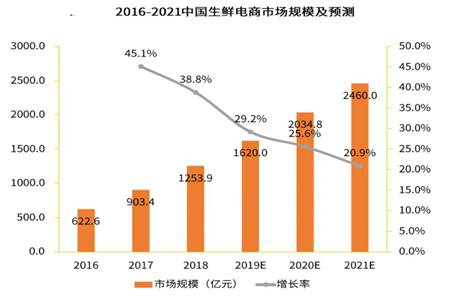

 

## 2. 系统架构

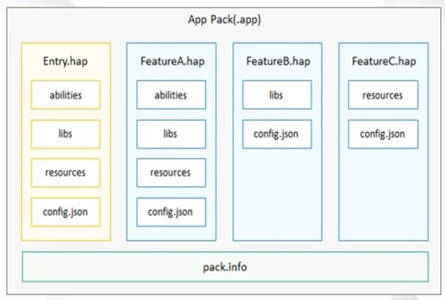

 

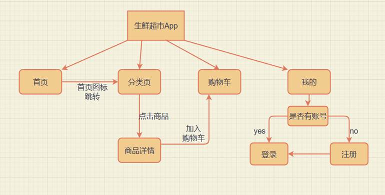

 

## 3. 项目功能展示

### 3.1 首页

顶部搜索栏，使用了组件显示，轮播图和商品分类，更多分类是调用http://124.71.79.186:8081/menu/findNav接口获取，通过list，for循环得到，限时抢购以及亿元补贴是静态数据

### 3.2 分类页

搜索框，一级分类，二级分类以及商品列表的数据都是通过接口获取，商品列表使用了组件

### 3.3 购物车

鸿蒙的轻量级存储在分类页或商品详情页添加商品进购物车后，可以在购物车页通过组件展示

 

### 3.4 商品详情

通过点击分类页的商品，路由到商品详情页，通过对应的商品id来获取商品信息，可以点击加入购物车来添加数据，点击购物车路由到购物车页面，整个页面都是通过list展示，自动排版

### 3.5 个人中心

通过storage判断用户名是否已经登录，来获取用户名

### 3.6 登录注册

根据接口传入手机号和密码，判断是否正确

根据传入的数据来调用接口来注册账号

## 4. 项目部分功能实现

### 4.1 首页商品分类

#### 4.1.1 功能实现

首页的商品分类分为普通分类与更多分类，为了便于List展示，我将商品分类的10个分割成两个数组存储，更多分类另外使用一个数组存储，使用ajax获取到商品列表后分别存进这几个数组，再通过hml页面的List遍历数组，依次列出每一个的商品菜单图片与名称。另外注意的是要想让更多商品实现左右滑动，需要设置flex-direction: row;属性

#### 4.1.2 hml部分

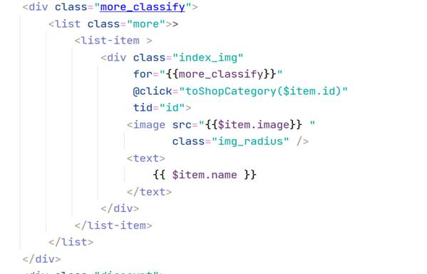

#### 4.1.3 js部分

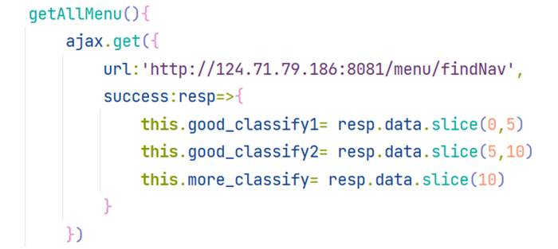

### 4.2 一级分类，二级分类以及商品展示

 

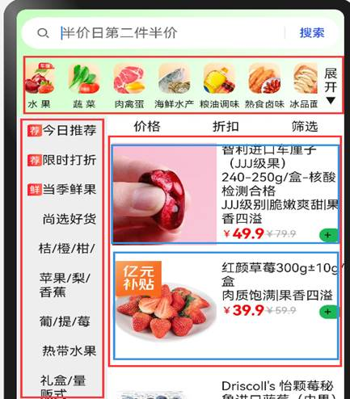

一级分类通过接口http://124.71.79.186:8081/menu/findNav调用，没有参数默认一级分类。并调用二级分类和商品列表方法实现初始化页面

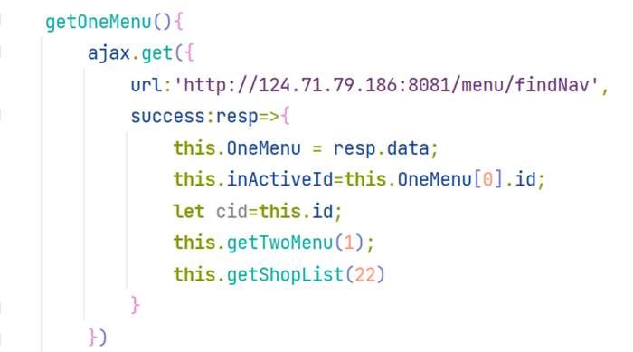

通过点击一级分类传入的cid来更新二级分类，

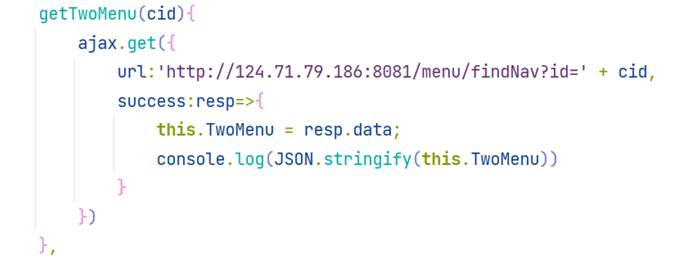

二级分类获取数据后，再调用接口获取对应的商品信息

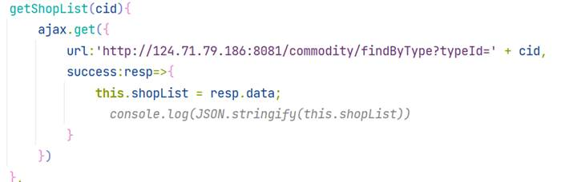

点击一级分类，会更改二级分类列表和商品列表，同样的，点击二级分类列表也会改变商品列表。这里是重新定义了两个方法，使其点击可以再次调用获取二级分类和商品列表方法，借此刷新界面

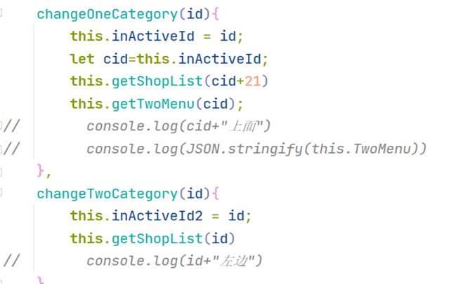

商品信息通过组件来显示,提升代码复用性

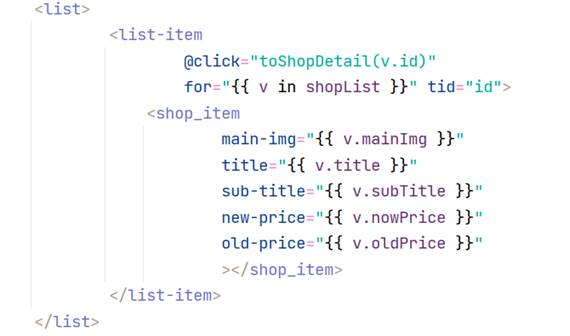

### 4.3 登录注册实现

通过调用登录接口来获取鸿蒙轻量级存储里面的数据，判断成功则跳转到我的界面，并显示username

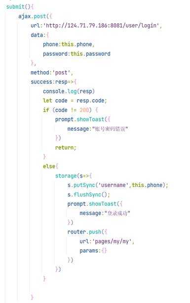

调用接口，将手机号及密码通过storage传入鸿蒙的轻量级存储中，并跳出弹窗“注册成功”，同时返回到登录页面

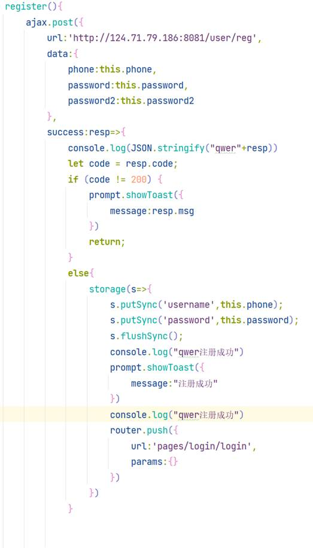

